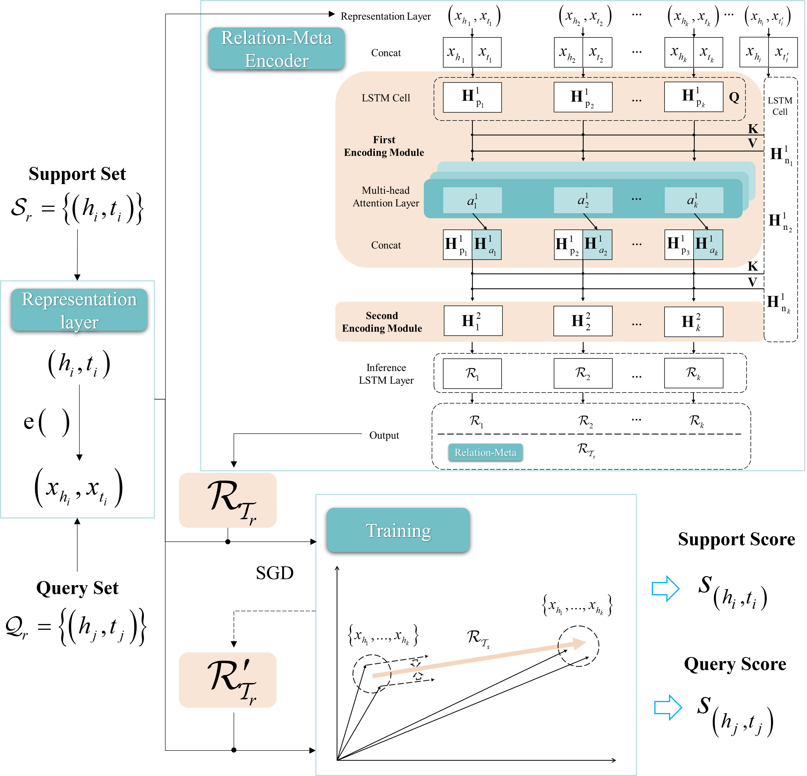

# Intro

This repo shows the meta relational learning code of paper: [**Resource recommendation based on industrial knowledge graph in low-resource conditions**](IJCIS). This code propose a Multi-head attention based Meta Relational Learning (MetaR) framework for link prediction. This code improve the previous work MetaR by optimizing both the relation-meta learner and the embedding learner. This repo are adapted from the metaR's repo (https://github.com/AnselCmy/MetaR)

<p align="center"></p>

## Running the Experiments

### Requirements

+ Python 3.6.7
+ PyTorch 1.0.1
+ tensorboardX 1.8

You can also install dependencies by

```bash
pip install -r requirements.txt
```

### Dataset

We use NELL-One and Wiki-One to test our model. You can download the zip files from [chen's repo] [Dropbox](https://www.dropbox.com/sh/d04wbxx8g97g1rb/AABDZc-2pagoGhKzNvw0bG07a?dl=0). Note that all these files were provided by chen.
After downloading, put the datasets in the root directory, like ./NELL or ./Wiki

### Quick Start for Training & Testing

For training and testing, here is an example for queick start,

```bash
# NELL-One, 1-shot, BG:Pre-Train
python main.py --dataset NELL-One --data_path ./NELL --few 1 --data_form Pre-Train --prefix nellone_1shot_pretrain --device 0
```
trainer_KGAT.py is the reimplementation of KGAT (https://arxiv.org/abs/1905.07854) under low-resource conditions.

Here are explanations of some important args,

```bash
--dataset:   "the name of dataset, NELL-One or Wiki-One"
--data_path: "directory of dataset"
--few:       "the number of few in {few}-shot, as well as instance number in support set"
--data_form: "dataset setting, Pre-Train or In-Train"
--prefix:    "given name of current experiment"
--device:    "the GPU number"
```

Normally, other args can be set to default values. See ``params.py`` for more details about argus if needed.

    print("""
    (Apology to Welkin)                        /
                                 _,.------....___,.' ',.-.
                              ,-'          _,.--'        |
                            ,'         _.-'              .
                           /   ,     ,'                   `
                          .   /     /                     ``.
                          |  |     .                       \.\\
                ____      |___._.  |       __               \ `.
              .'    `---''       ``'-.--''`  \               .  \\
             .  ,            __               `              |   .
             `,'         ,-''  .               \             |    L
            ,'          '    _.'                -._          /    |
           ,`-.    ,'.   `--'                      >.      ,'     |
          . .'\\'   `-'       __    ,  ,-.         /  `.__.-      ,'
          ||:, .           ,'  ;  /  / \ `        `.    .      .'/
          j|:D  \          `--'  ' ,'_  . .         `.__, \   , /
         / L:_  |                 .  '' :_;                `.'.'
         .    '''                  ''''''                    V
          `.                                 .    `.   _,..  `
            `,_   .    .                _,-'/    .. `,'   __  `
             ) \`._        ___....----''  ,'   .'  \ |   '  \  .
            /   `. '`-.--''         _,' ,'     `---' |    `./  |
           .   _  `'''--.._____..--'   ,             '         |
           | .' `. `-.                /-.           /          ,
           | `._.'    `,_            ;  /         ,'          .
          .'          /| `-.        . ,'         ,           ,
          '-.__ __ _,','    '`-..___;-...__   ,.'\ ____.___.'
          `'^--'..'   '-`-^-''--    `-^-'`.'''''''`.,^.`.--' mh
    """)
    
## Cite
```
Liu, Yangshengyan, et al. "Resource recommendation based on industrial knowledge graph in low-resource conditions." International Journal of Computational Intelligence Systems 15.1 (2022): 42.
